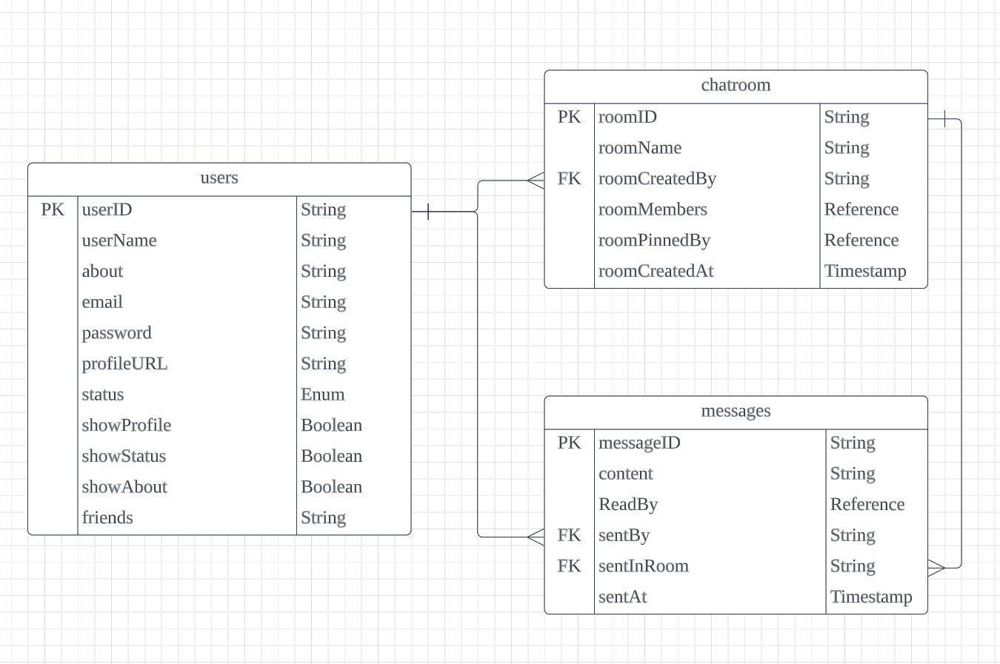
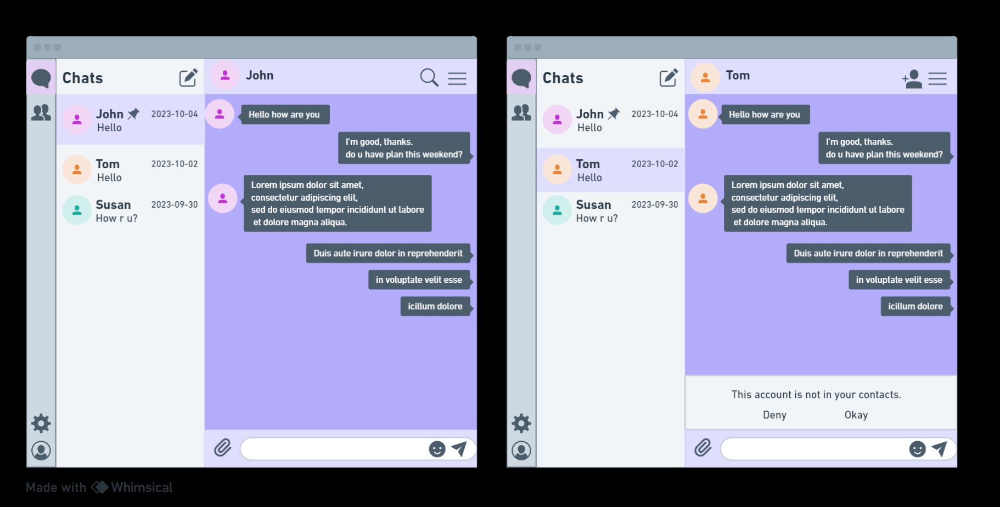
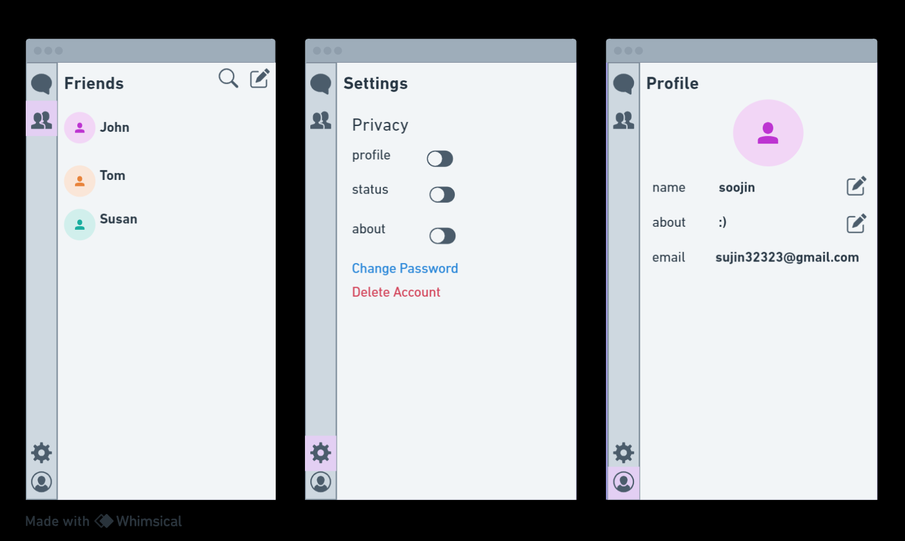

# chatapp-soojin-yen-bosco-final

Realtime Chat Application using MERN Stack

Our real-time chat application provides a simple and user-friendly platform for one-on-one chat.

- **Tech stack - MERN stack (MongoDB, Express, React, Node.js)**

  1. Front-End : React, Redux, React Router, WebSocket Library
  2. Back-End : Node.js, Express, WebSocket Library
  3. Database : MongoDB

- **DEMO**
 <video width="1000px" height="340px" controls>
    <source src="./images/chatAppDemo.mp4" type="video/mp4">
  </video>

- **ERD**
  

- **Wireframes**
  
  
- **User stories**

  1. Sending a Message  
     As a user,  
     I want to send a text message to another user in a chat room,  
     so that I can communicate with them in real-time.

  2. Receiving Message Notifications  
     As a user,  
     I want to receive notifications when I receive a message from a stranger,  
     so that I can choose to answer or deny to the message.

  3. Adding Friends  
     As a user,  
     I want to be able to add other users as friends or connections,  
     so that I can easily initiate private conversations and see when they are online.
  4. Customizing My Profile  
     As a user, I want to be able to customize my profile by adding a profile picture, updating my status, and providing some personal information,  
     so that I can personalize my presence in the chat application and share some details with others.

  5. Changing User Settings  
     As a user, I want to be able to customize my account settings,  
     so that I can control my privacy.

  6. Manage Friends List  
     As a user, I want to be able to manage my list of friends or connections,  
     so that I can organize and interact with my friends.
